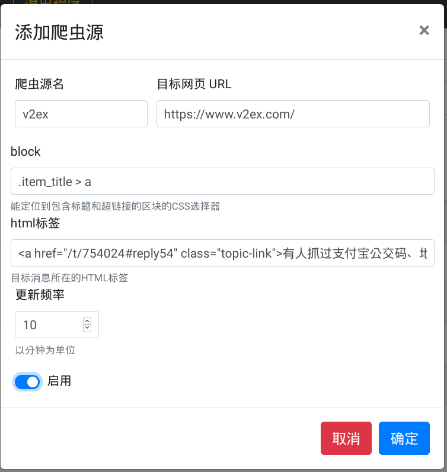
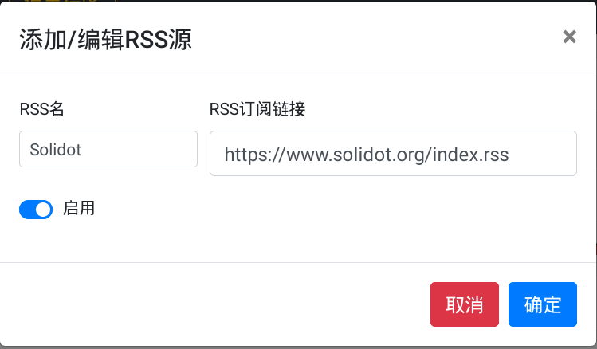
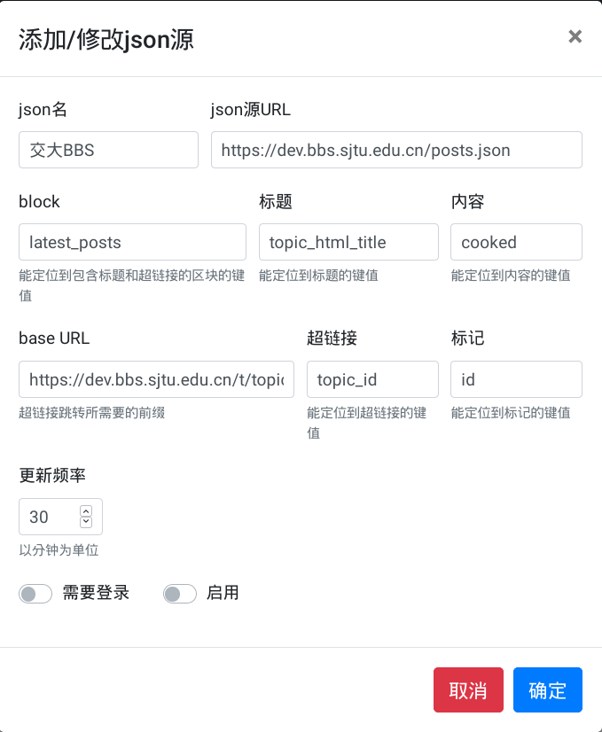
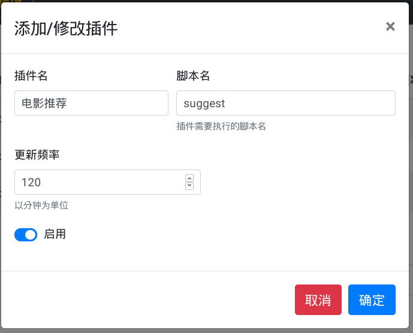
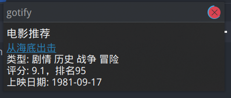
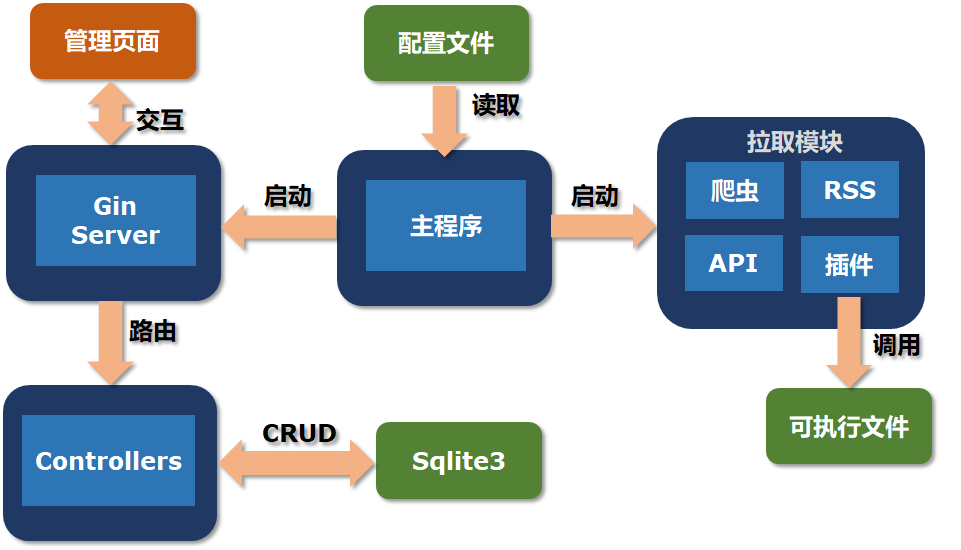
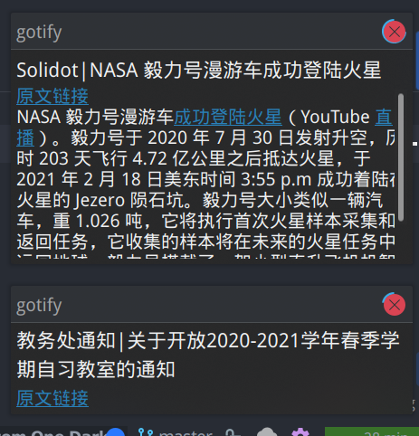
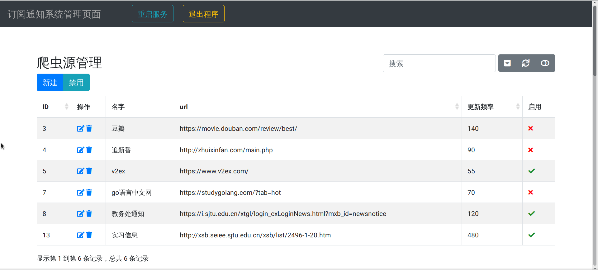
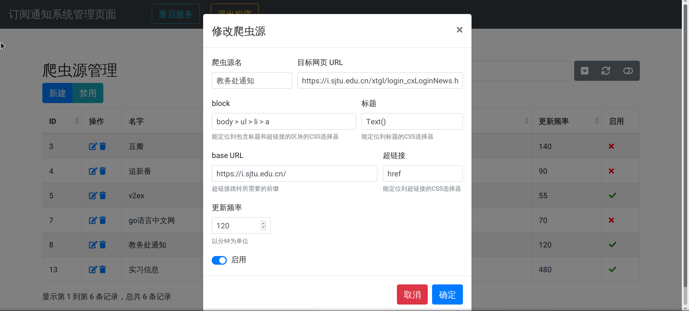

# gotify 

Go协程驱动的自动化多源订阅通知系统

## 介绍

`gotify`来自`go`和`notify`的组合，意为“通知”。核心功能为，用户按照既定的规则添加消息源，通知系统就能以给定频率定时拉取对应源，如果有新消息就弹出桌面通知。

### Why

为什么要做这样一个软件呢？我平时会因为怕错过通知，频繁地登上教务处网站或者查看RSS阅读器，也曾经因为疫情整天刷新闻网站，总觉得精力太分散了，于是我就就做了这样一个整合的通知软件。将重要的订阅源录入系统后，系统会定时自动拉取信息，有最新通知就弹出桌面通知。

### 功能

`gotify`目前支持4种订阅源：

+ 爬虫源：即需要用爬虫的方式来得到消息的源，只要目标消息是以列表形式存在于网页中的，都可以作为爬虫源添加，例如v2ex；

+ `RSS`源：目标消息来源于`RSS`订阅链接，例如交大葡萄和`Canvas`平台通知的`RSS`订阅链接；

+ `API`源：目标消息来源于公开的`API`接口，例如交大水源社区的通知`API`，获取的格式通常为`json`；

+ 插件：获取某些信息时设计的逻辑比较复杂，爬虫难以驾驭（例如推荐电影功能，需要爬取豆瓣，然后随机选取一个高分电影进行推荐），就需要编写脚本（如`Python`脚本）来实现

### 使用方法

```bash
git clone https://github.com/greenhandatsjtu/gotify.git
go run .
```

配置文件保存在`~/.gotify/config.json`中，主要负责控制4种订阅源的启用以及管理页面的启用与否，默认配置如下：

```json
{
  "database": {
    "init": false
  },
  "server": {
    "enable": true,
    "ip": "0.0.0.0",
    "port": 12312
  },
  "http-client": {
    "timeout": 30
  },
  "crawler": true,
  "rss": true,
  "json": true,
  "plugin": true
}
```

管理页面默认运行在`localhost:12312`，可根据需要更改。

#### 添加爬虫源

以v2ex为例，需要输入爬虫源名用于区分，目标网页URL（要爬取的页面），block（能定位到包含标题和超链接的区块的CSS selector），html标签（将其中一条消息的HTML复制过来即可），更新频率（以分钟为单位），以及更新频率，如下所示：



#### 添加RSS源

该模块使用[github.com/SlyMarbo/rss](https://github.com/SlyMarbo/rss)，支持RSS 1.0, 2.0, 以及Atom 1.0。以添加Solidot的RSS为例：



#### 添加API源

以交大水源社区API为例，需要输入json名，json源URL，block（能定位到包含标题和超链接的区块的键值），标题（能定位到标题的键值），内容（能定位到内容的键值），base URL（超链接跳转所需要的前缀），超链接（能定位到超链接的键值），标记（能定位到标记的键值，用于标记该条信息是否已经通知过），以及更新频率，如下所示：



#### 添加插件

插件用于完成爬虫难以完成的复杂操作。编写脚本后将其保存至`~/.gotify/plugins/`文件夹下，示例脚本如下：

```python
#!/usr/bin/python3

import requests
import random
import json


def main():
    url = 'https://movie.douban.com/j/chart/top_list'
    _type = random.randint(1, 25)
    params = {
        'type': _type,
        'interval_id': '100:90',
        'limit': 100
    }
    headers = {
        "user-agent": "Mozilla/5.0 (X11; Linux x86_64) AppleWebKit/537.36 (KHTML, like Gecko) Chrome/80.0.3987.163 Safari/537.36",
        "accept": "application/json"
    }
    try:
        res = requests.get(url, params=params, headers=headers, timeout=5)
    except:
        return
    movies = res.json()
    length = len(movies)
    if length==0:
        return
    _id = random.randint(0, length - 1)
    movie = movies[_id]
    print("<a href=\"{}\">{}</a>\n类型: {}\n评分: {}，排名{}\n上映日期: {}".format(movie['url'], movie['title'], ' '.join(movie['types']), movie['score'], movie['rank'], movie['release_date']))


if __name__ == '__main__':
    main()
```

该脚本会从豆瓣高分电影集中随机选择一部电影进行推荐。

添加脚本示例如下，脚本名为脚本的文件名：



通知示例如图：



## 架构

+ 后端：gin+GORM+sqlite3
+ 前端：Bootstrap-Table
+ 通知模块：[github.com/gen2brain/beeep](https://github.com/gen2brain/beeep)



## 截图

### 通知效果



### 管理页面



### 修改/添加订阅源



## Todo

+ [ ] 用`Vue`重写前端
+ [ ] 完善重启操作（现在重启过后部分`goroutine`不会退出，可以用`context`来控制）
+ [ ] 执行增/删/改操作后无需重启，自动完成`goroutine`删除/替换